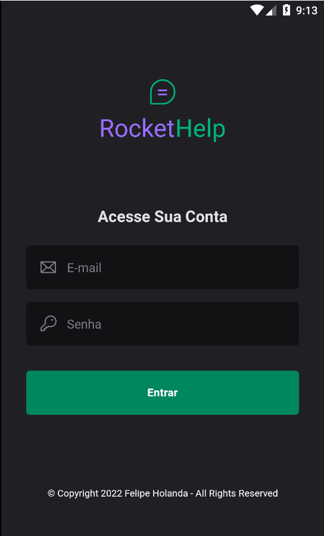
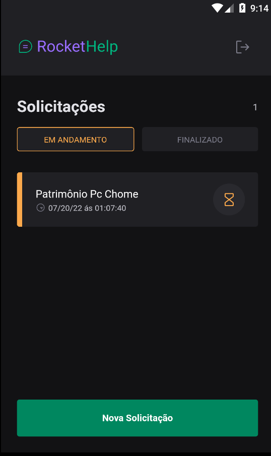
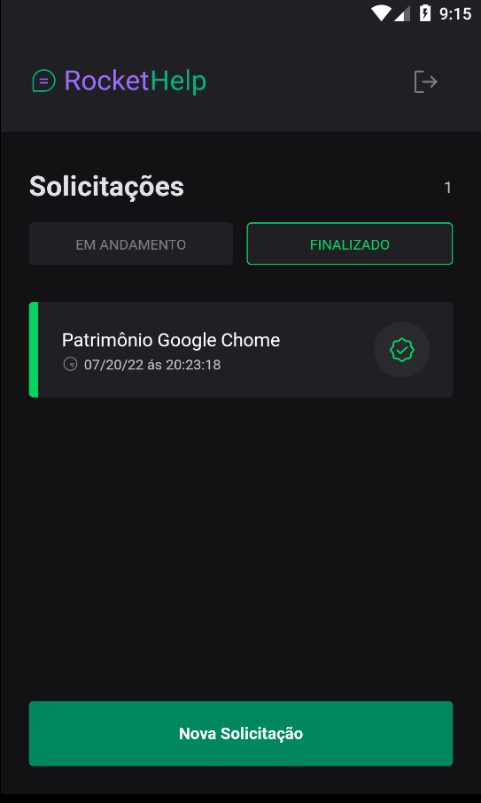
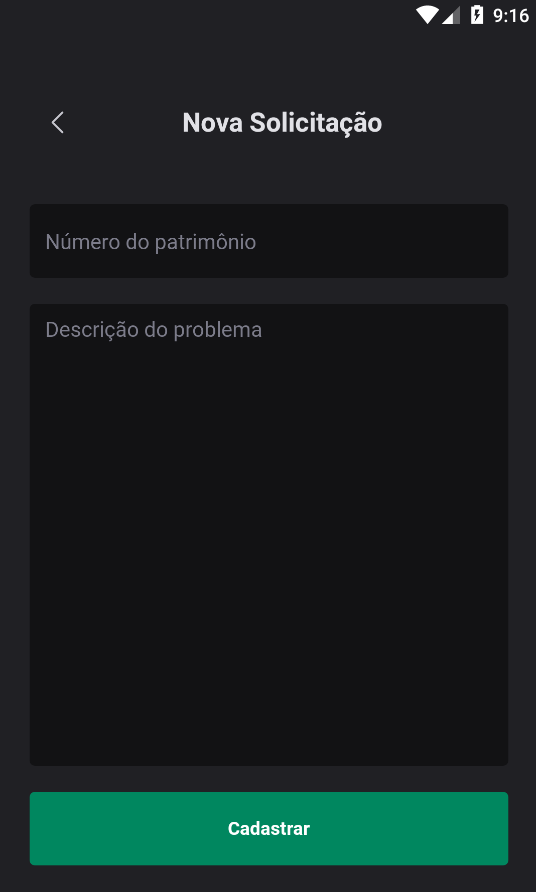

# Ticket_Help
Um App de aba de chamados e tickets para empresas de suporte ao cliente

 

## Instalação
1. Clone esse repositório ou faça o download dos arquivos
2. Abra o projeto no Visual Studio Code
3. Abra o Terminal e execute o comando `expo init` para instalar os módulos do Node.
4. Use o comando `react-native link` para que todos os assets sejam linkados ao projeto
5. Execute o projeto com `expo start` ou `expo run:android` se desejar que o firebase funcione dentro da aplicação.
6. Enjoy!

 

<h1>Capturas de tela</h1>

<table>
 <tr>
    <td></td>
    <td></td>
    <td></td>
    <td></td>
  </tr>
</table>

### Ferramentas

  - [**VS CODE**](https://code.visualstudio.com/)
  - [**EXPO**](https://getbootstrap.com/)

 

<h1>Siga-me</h1>
  
Made with 💜 by FELIPE HOLANDA 👋🏻  [See my Linkedin](https://www.linkedin.com/in/felipe-holanda-de-freitas-3a91281a2/)

  
 

   

